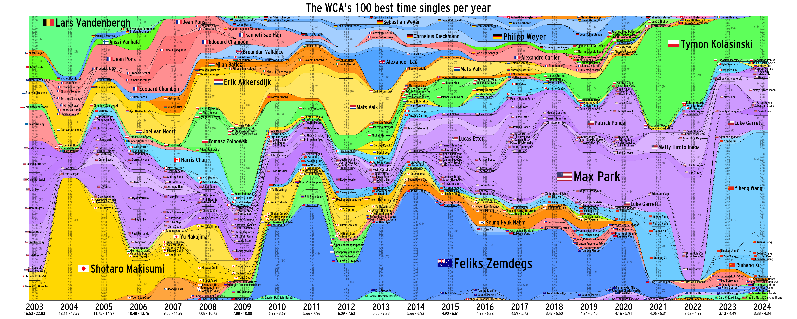

# Stacked Area Charts of Top WCA solves

Creates a Stacked Area Chart of the 100 best WCA results of an event, per year!



## Steps for setup:
* 1. Download this repo.
* 2.  Download the most recent WCA .tsv export from here (https://www.worldcubeassociation.org/export/results), extract the .zip, and put the files in the /data folder.
* 3.  Extract the flags.zip folder. Make sure the flag images are in the /flags folder.

## Steps for creating images:
* 1. Open a command prompt from this directory.
* 2. Run this command, which will create a simplified .csv data file!  (Takes 5 seconds on my computer)
   ```
   python create_top100.py 333
   ```
* 3. If you ever have a .csv data file, then run this command to produce the final image:   (Takes 0.8 seconds on my computer)
   ```
   python create_graph.py 333
   ```
* 4. Voila! The image should show up in your folder as "SAC_graph_333.png".

## Customize it!

You can change the event to whatever you want. In these examples, it's 333. But you can also choose from this list (taken from WCA_export_Events.tsv):
```
222, 333, 333bf, 333fm, 333ft, 333mbf, 333mbo, 333oh, 444, 444bf, 555, 555bf, 666, 777, clock, magic, minx, mmagic, pyram, skewb, sq1
```

If you want to make a chart for averages, not singles, simply append "_a" to the end of the event parameter, like so:
 ```
   python create_top100.py 333_a
   ```

## Disclaimer

I wrote this code in a couple days, so the text might not show up correctly with the oddball events, like FMC or Multi-Blind.
